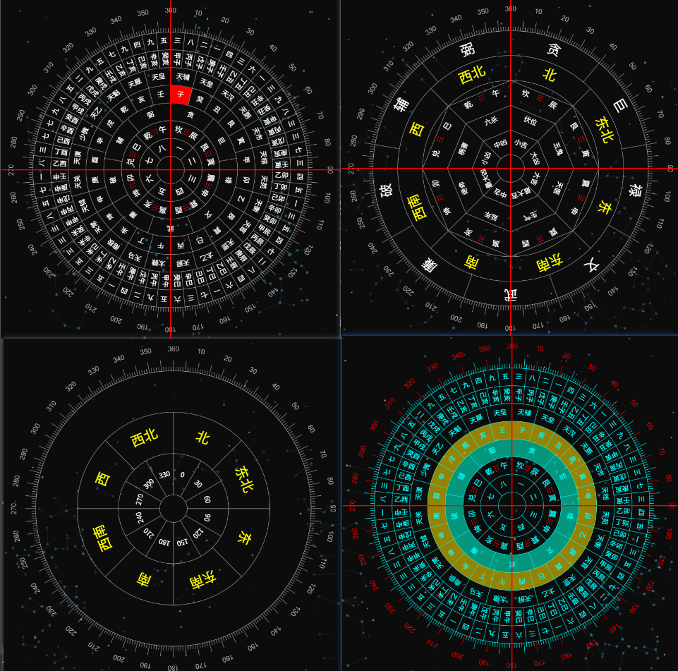
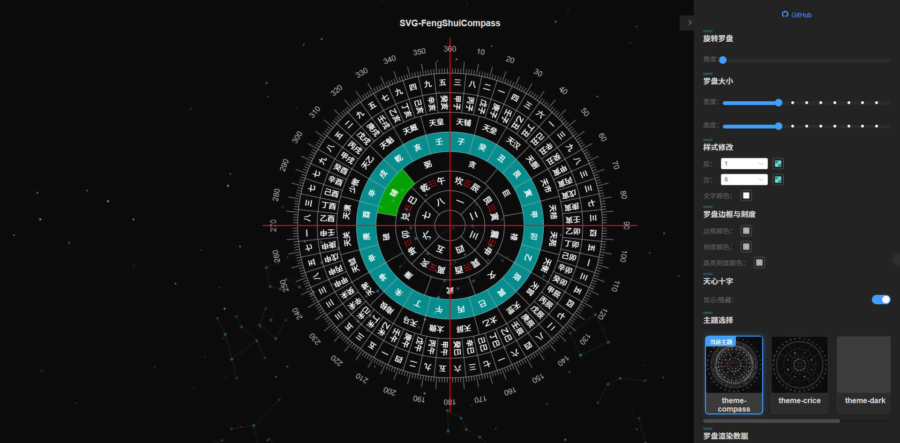

## FengShuiCompass - 自定义罗盘
自定义罗盘数据和样式，基本样式配置.
分 canvas(旧) 版本 和 svg 版本

在线演示：[https://compass.zzerx.cn/](https://compass.zzerx.cn/)

<!--  -->



## 开始
概念：
 `层：一圈的数据为层，下标从0开始。`, `宫：一层中的一格为宫，下标从0开始`

## 安装
```shell
npm i feng-shui-compass
```

## SVG版本的FengShuiCompassSvg.vue 组件
相比Canvas版本，SVG版本具有以下优势：
1. 更好的缩放性能，不会失真
2. 更容易实现交互效果
3. 支持多边形罗盘

### 基本使用
```js
import { FengShuiCompassSvg, themes } from 'feng-shui-compass';
import 'feng-shui-compass/dist/style.css';

// 使用预设主题
const compassConfig = reactive(themes.compassTheme);

// 或自定义配置 (按照规则)
const compassConfig = reactive({
  info: { 
    id: 'custom-compass'
  },
  compassSize: { 
    width: 500, 
    height: 500 
  },
  latticeFill: [
    [0, 1, "rgba(255, 166, 0, 0.57)"],
    // [0, 1, "#FF0000"],
  ],
  scaclStyle:{
    minLineHeight: 10,
    midLineHeight: 25,
    maxLineHeight: 25,
  },
  line: {
    borderColor: "#AAAAAA",
    scaleColor: "#AAAAAA",
    scaleHighlightColor: "#AAAAAA",
  },
  isShowTianxinCross: false,
  data: [
    {
      name: "方位",
      startAngle: 0,
      fontSize: 32,
      textColor: "#ffff00",
      vertical: false,
      togetherStyle: "empty",
      data: ["北", "东北", "东", "东南", "南", "西南", "西", "西北"],
    },
    {
      name: "刻度标记",
      startAngle: 0,
      fontSize: 18,
      textColor: "#cccccc",
      vertical: true,
      togetherStyle: "empty",
      data: [],
    },
  ],
});
```

```html
<template>
  <FengShuiCompassSvg
    :config="compassConfig"
    @latticeClick="handleLatticeClick"
  />
</template>
```

### 组件配置
组件使用统一的 config 对象进行配置，包含以下属性：，具体用例可参考 themes

| 属性名 | 类型 | 默认值 | 说明 |
|--------|------|--------|------|
| info | Object | - | 包含 id、name、preview 等基本信息 |
| compassSize | Object | { width: 800, height: 800 } | 罗盘尺寸配置 |
| data | Array | [] | 罗盘数据配置，参考 [层配置参数](###data) |
| line | Object | { borderColor: "#AAAAAA", scaleColor: "#AAAAAA", scaleHighlightColor: "#AAAAAA" } | 线条样式配置 |
| rotate | Number | 0 | 旋转角度 |
| ~~layerFilt~~   | Array[] | [] | 层填充配置数组（svg版已弃用）  |
| latticeFill | Array[] | [] | 宫格填充配置，格式: [[宫格索引, 层索引, 颜色]] |
| isShowTianxinCross | Boolean | true | 是否显示天心十字 |
| isShowScale | Boolean | true | 是否显示刻度 |
| scaclStyle | Object | { minLineHeight: 10, midLineHeight: 25, maxLineHeight: 25 } | 刻度样式配置 |
| autoFontSize | Boolean | true | 是否自动计算字体大小 |
| animation | Object | { enable: false, duration: 1000, delay: 100 } | 动画配置 |

### info 配置
基础标识信息 

| 属性名 | 类型 | 默认值 | 说明 |
|--------|------|--------|------|
| id | String/Number | - | 唯一标识符，用于主题切换时的动画控制 |
| name | String | - | 主题名称 |
| preview | String | - | 主题预览图路径 |

### line 配置
线条样式配置

| 属性名 | 类型 | 默认值 | 说明 |
|--------|------|--------|------|
| borderColor | String | "#AAAAAA" | 边框颜色 |
| scaleColor | String | "#AAAAAA" | 刻度线颜色 |
| scaleHighlightColor | String | "#AAAAAA" | 高亮刻度线颜色 |

### scaclStyle 配置
刻度样式配置

| 属性名 | 类型 | 默认值 | 说明 |
|--------|------|--------|------|
| minLineHeight | Number | 10 | 最小刻度线高度 |
| midLineHeight | Number | 25 | 中等刻度线高度 |
| maxLineHeight | Number | 25 | 最大刻度线高度 |

### animation 配置
动画效果配置

| 属性名 | 类型 | 默认值 | 说明 |
|--------|------|--------|------|
| enable | Boolean | true | 是否启用动画 |
| duration | Number | 1000 | 动画持续时间（毫秒） |
| delay | Number | 100 | 层间动画延迟（毫秒） |

### data
层配置参数

| 参数名  | 类型  | 默认值 | 必填 | 说明 |
|-------------|------------|--------|----| ----------------------------------------------------------------------------------------------------------------------------------- |
| name          | String/Array | -        | 否   | 层名称。当为数组时可配置多个名称                                                                                                    |
| startAngle    | Number       | 0        | 否   | 起始角度，范围 0-360 （只有圆形层支持）                                                                                                               |
| fontSize      | Number       | -        | 否   | 字体大小(推荐开启autoFontSize)                                                                                                      |
| textColor     | String/Array | '#000'   | 否   | 字体颜色。当为数组时可配置多个颜色                                                                                                  |
| vertical      | Boolean      | false    | 否   | 是否垂直显示文字                                                                                                                    |
| data          | Array        | -        | 是   | 层数据，支持一维数组和二维数组                                                                                                      |
| togetherStyle | String       | 'empty'  | 否   | 统一风格，见下方说明                                                                                                                |
| shape         | String       | 'circle' | 否   | 层形状，可选值：'circle'(圆形)、'polygon'(多边形)，如果使用多边形建议保持边数量一致，如果混用多边形和圆形，建议圆形在外，多边形在内 |

### dataItem togetherStyle 可选值

| 值      | 说明               |
| ------- | ------------------ |
| empty   | 默认样式，常规显示 |
| equally | 平分宫格样式       |

### dataItem shape 可选值

| 值      | 说明                                   |
| ------- | -------------------------------------- |
| circle  | 默认样式，圆形层                       |
| polygon | 多边形层，根据宫格数量自动生成正多边形 |


### 事件
| 事件名 | 参数 | 说明 |
|--------|------|------|
| latticeClick | { latticeIndex, layerIndex, data } | 宫格点击事件 |


## canvas 版本 的 vue 组件 （旧）
详细可参考示例代码
```html
<script setup>
import { FengShuiCompass, themes } from 'feng-shui-compass';
import 'feng-shui-compass/dist/style.css';

    ...
</script>
    <FengShuiCompass
      :width="2000"
      :height="2000"
      v-model:rotate="rotate"
      :compassData="themes.data"
      v-model:layerFilt="layerFilt"
      v-model:latticeFill="latticeFill"
      :scaclStyle="scaclStyle"
    ></FengShuiCompass>
```
此处的width，height 为canvs画布大小，非div大小

###  canvas 版本直接使用 CompassCanvasCreateor 绘制
```js
import { CompassCanvasCreateor } from 'feng-shui-compass';
const { FengShuiCompass, CompassData } =  CompassCanvasCreateor;
const compassData = new CompassData().getAllData();
const fs = new FengShuiCompass();
 let canvas /* = canvas 元素 */
//获取canvas上下文
 let ctx = canvas.getContext("2d");
//链式调用显示罗盘
    //设置中心点
  fs.setCenterPoint(props.width / 2, props.height / 2)
    //设置半径
    .setRadius(props.height / 2)
    //设置宫填充色（二维数组格式[层][宫]，支持循环填充且不覆盖已有颜色）
    .setLatticeFill()
    //设置层填充色（数组格式，支持循环填充且保留原有刻度线）
    .setLayerFill([])
    //设置刻度样式
    .setScaclStyle({
      minLineHeight: 10,
      midLineHeight: 25,
      maxLineHeight: 25,
      numberFontSize: 30,
    })
    //添加罗盘数据
    .setCompassData(compassData) //必须在配置所有基本数据完成之后执行
    .draw(ctx); //draw 必须setCompassData完成之后执行 终止链式

```
## 其他
欢迎 PR / ISSUE / 交流
