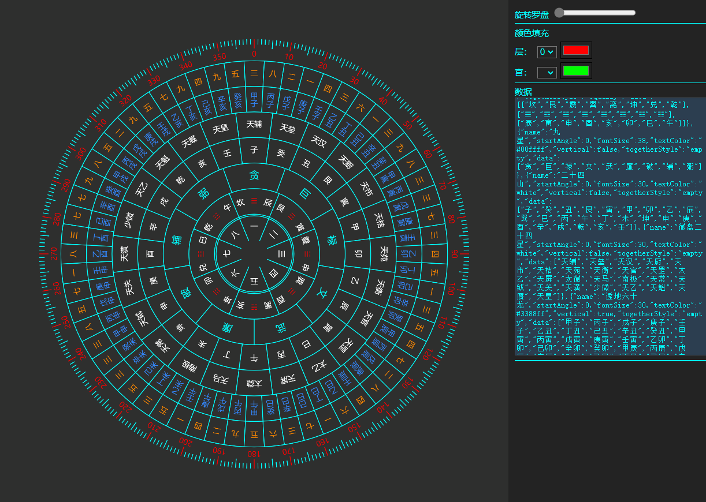
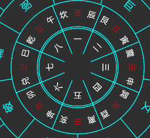

# FengShuiCompass - 自定义罗盘
自定义罗盘数据和样式，基本样式配置，控制罗盘旋转是外部控制。可自定义显示的数据，文字颜色，具体位置填充，文字显示样式等，之前写的，许多结构很陈旧，现在用vue重新封装，并修改了部分逻辑。


# 开始
概念：

 层：一圈的数据为层，下标从0开始。

 宫：一层中的一格为宫，下标从0开始

## 方式一 直接使用compass-main.js
```js
import { FengShuiCompass, CompassData } from "./compass-main.js";
const compassData = new CompassData().getAllData();
const fs = new FengShuiCompass();
 let canvas /* = canvas 元素 */
//获取canvas上下文
 let ctx = canvas.getContext("2d");
//链式调用显示罗盘
    //设置中心点
  fs.setCenterPoint(props.width / 2, props.height / 2)
    //设置半径
    .setRadius(props.height / 2)
    //设置宫填充色
    .setLatticeFill([[]])
    //设置层填充色
    .setLayerFill([])
    //设置刻度样式
    .setScaclStyle({
      minLineHeight: 10,
      midLineHeight: 25,
      maxLineHeight: 25,
      numberFontSize: 30,
    })
    //添加罗盘数据
    .setCompassData(compassData) //必须在配置所有基本数据完成之后执行
    .draw(ctx); //draw 必须setCompassData完成之后执行 终止链式
```
## compassData - 配置
内部预置了一个基本数据样式，compassData的数据格式为数据内部每一层的数据为Object。
例子： [{层0...},{层1...}，...]
层数据有

 *层名：**name**， -String

 起始角度：**startAngle**，

 字体大小：**fontSize** ，

 字体颜色： **textColor**，
 
 字体垂直显示：**vertical**，
 
 统一风格（bate）： **togetherStyle** 暂时只支持【 **默认：empty** 和 **平分 ：equally**】
  
 *层数据：  **data**   支持一维，二维数组

部分数据有默认值，详细数据参考位置，**compass-main.js -> class FengShuiCompass {**.
```js
[
  {
    name: '八数',                         //层名
    startAngle: 0,                       //起始角度
    fontSize: 78,
    textColor: 'white',
    vertical: false,                 
    togetherStyle: 'empty',
    data: ["一", "二", "三", "四", "五", "六", "七", "八"] //单层单数据
  },
  {
        name: ['后先天八卦', '先天八卦', '龙上八煞'],
        startAngle: 0,
        fontSize: 18,
        textColor: ['white', 'red', 'white'], 
        vertical: false,
        togetherStyle: 'equally',
        data: [   //单层多数据
          ['坎', '艮', '震', '巽', '离', '坤', '兑', '乾'],
          ['☰', '☲', '☱', '☴', '☵', '☶', '☳', '☷'],
          ["辰", "寅", "申", "酉", "亥", "卯", "巳", "午"]
        ]
      }
      ...
]
```
单层多数据->   文字垂直-> 

## 方式二 vue中使用封装的FengShuiCompass.vue 组件
详细可参考示例代码
```html
<script setup>
    import FengShuiCompass from "./components/FengShuiCompass.vue";
    ...
</script>
    <FengShuiCompass
      :width="2000"
      :height="2000"
      v-model:rotate="rotate"
      :compassData="compassData"
      v-model:layerFilt="layerFilt"
      v-model:latticeFill="latticeFill"
      :scaclStyle="scaclStyle"
    ></FengShuiCompass>
```
此处的width，height 为canvs画布大小，非div大小


# 应用在小程序的demo


# 其他&方向
数据配置方式还未加入直接配置宫层填充色方式，封装的组件功能还很少。