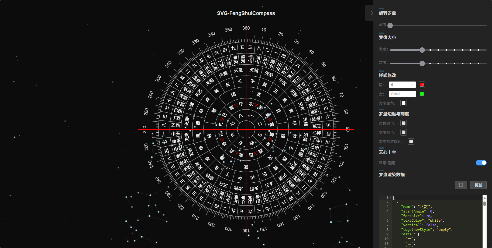

# FengShuiCompass - 自定义罗盘
自定义罗盘数据和样式，基本样式配置.
分 canvas 版本 和 svg 版本

在线演示：[https://compass.zzerx.cn/](https://compass.zzerx.cn/)

<!--  -->

# 开始
概念：

 层：一圈的数据为层，下标从0开始。

 宫：一层中的一格为宫，下标从0开始

## compassData - 配置
内部预置了一个基本数据样式，compassData 的数据格式为数组，每个元素代表一层的配置对象。格式：`[{层0配置}, {层1配置}, ...]`

### 层配置参数

| 参数名 | 类型 | 默认值 | 必填 | 说明 |
|--------|------|--------|------|------|
| name | String/Array | - | 是 | 层名称。当为数组时可配置多个名称 |
| startAngle | Number | 0 | 否 | 起始角度，范围 0-360 |
| fontSize | Number | 30 | 否 | 字体大小 |
| textColor | String/Array | '#000' | 否 | 字体颜色。当为数组时可配置多个颜色 |
| vertical | Boolean | false | 否 | 是否垂直显示文字 |
| data | Array | - | 是 | 层数据，支持一维数组和二维数组 |
| togetherStyle | String | 'empty' | 否 | 统一风格，见下方说明 |
| shape | String | 'circle' | 否 | 层形状，可选值：'circle'(圆形)、'polygon'(多边形)，如果使用多边形建议保持边数量一致，如果混用多边形和圆形，建议圆形在外，多边形在内 |

### togetherStyle 可选值

| 值 | 说明 |
|--------|------|
| empty | 默认样式，常规显示 |
| equally | 平分宫格样式 |

### shape 可选值

| 值 | 说明 |
|--------|------|
| circle | 默认样式，圆形层 |
| polygon | 多边形层，根据宫格数量自动生成正多边形 |

多边形示例：
```js
{
  name: '八卦',
  shape: 'polygon',  // 设置为八边形
  data: ["坎", "艮", "震", "巽", "离", "坤", "兑", "乾"],
  // ... 其他配置
}
```
```js
[
  {
    name: '八数',                         //层名
    startAngle: 0,                       //起始角度
    fontSize: 78,
    textColor: 'white',
    vertical: false,                 
    togetherStyle: 'empty',
    data: ["一", "二", "三", "四", "五", "六", "七", "八"] //单层单数据
  },
  {
        name: ['后先天八卦', '先天八卦', '龙上八煞'],
        startAngle: 0,
        fontSize: 18,
        textColor: ['white', 'red', 'white'], 
        vertical: false,
        togetherStyle: 'equally',
        data: [   //单层多数据
          ['坎', '艮', '震', '巽', '离', '坤', '兑', '乾'],
          ['☰', '☲', '☱', '☴', '☵', '☶', '☳', '☷'],
          ["辰", "寅", "申", "酉", "亥", "卯", "巳", "午"]
        ]
      }
      ...
]
```
单层多数据->   

文字垂直-> 


## SVG版本的FengShuiCompassSvg.vue 组件
相比Canvas版本，SVG版本具有以下优势：
1. 更好的缩放性能，不会失真
2. 更容易实现交互效果

### 基本使用
```html
<script setup>
import FengShuiCompassSvg from "./components/fs-compass-svg/FengShuiCompassSvg.vue";
import CompassData from "./data/compass-data.js";

// 罗盘旋转角度
let rotate = ref(0);
// 罗盘数据
let compassData = ref(CompassData);
// 层填充数据
let layerFilt = ref([]);
// 宫格填充数据
let latticeFill = ref([]);

// 处理宫格点击事件
function handleLatticeClick(event) {
  console.log("宫格被点击：", event);
}
</script>

<template>
  <FengShuiCompassSvg
    :width="800"
    :height="800"
    :rotate="rotate"
    :compassData="compassData"
    :layerFill="layerFilt"
    :latticeFill="latticeFill"
    :borderColor="'#000'"
    :scaleColor="'#000'"
    :scaleHighlightColor="'red'"
    :isShowTianxinCross="true"
    :tianxinCrossColor="'red'"
    :tianxinCrossWidth="2"
    @latticeClick="handleLatticeClick"
  />
</template>
```

### 组件属性
| 属性名 | 类型 | 默认值 | 说明 |
|--------|------|---------|------|
| width | Number | - | 罗盘宽度 |
| height | Number | - | 罗盘高度 |
| rotate | Number | 0 | 罗盘旋转角度 |
| compassData | Array | [] | 罗盘数据配置，格式同Canvas版本 |
| layerFill | Array | [] | 层填充配置，支持颜色和渐变 |
| latticeFill | Array | [] | 宫格填充配置 |
| borderColor | String | '#000' | 罗盘边框颜色 |
| scaleColor | String | '#000' | 刻度线颜色 |
| scaleHighlightColor | String | 'red' | 高亮刻度线颜色 |
| isShowTianxinCross | Boolean | true | 是否显示天心十字 |
| tianxinCrossColor | String | 'red' | 天心十字颜色 |
| tianxinCrossWidth | Number | 2 | 天心十字线宽 |
| autoFontSize | Boolean | false | 是否自动计算字体大小 |

### 事件
| 事件名 | 参数 | 说明 |
|--------|------|------|
| latticeClick | {layerIndex, latticeIndex} | 宫格点击事件，返回层索引和宫格索引 |

### 渐变填充示例
```js
// 线性渐变
let layerFill = ref([
  'linear-gradient(45deg, #fe6b8b 30%, #ff8e53 90%)',
  'linear-gradient(45deg, #2196F3 30%, #21CBF3 90%)'
]);

// 径向渐变
let layerFill = ref([
  'radial-gradient(circle, #fe6b8b 30%, #ff8e53 90%)',
  'radial-gradient(circle, #2196F3 30%, #21CBF3 90%)'
]);
```

### 自动字体大小
启用autoFontSize后，组件会根据罗盘大小自动计算合适的字体大小：
```html
<FengShuiCompassSvg
  :autoFontSize="true"
  ...
/>
```


## canvas 版本 的FengShuiCompass.vue 组件 （旧）
详细可参考示例代码
```html
<script setup>
    import FengShuiCompass from "./components/FengShuiCompass.vue";
    ...
</script>
    <FengShuiCompass
      :width="2000"
      :height="2000"
      v-model:rotate="rotate"
      :compassData="compassData"
      v-model:layerFilt="layerFilt"
      v-model:latticeFill="latticeFill"
      :scaclStyle="scaclStyle"
    ></FengShuiCompass>
```
此处的width，height 为canvs画布大小，非div大小

###  canvas 版本直接使用compass-main.js 
```js
import { FengShuiCompass, CompassData } from "./compass-main.js";
const compassData = new CompassData().getAllData();
const fs = new FengShuiCompass();
 let canvas /* = canvas 元素 */
//获取canvas上下文
 let ctx = canvas.getContext("2d");
//链式调用显示罗盘
    //设置中心点
  fs.setCenterPoint(props.width / 2, props.height / 2)
    //设置半径
    .setRadius(props.height / 2)
    //设置宫填充色（二维数组格式[层][宫]，支持循环填充且不覆盖已有颜色）
    .setLatticeFill([
      [
        ['#FF0000', '#00FF00'], // 第0层各宫颜色（当宫数>颜色数时会循环使用）
        ['rgba(255,165,0,0.5)'] // 第1层颜色（单颜色自动循环）
      ]
    ])
    //设置层填充色（数组格式，支持循环填充且保留原有刻度线）
    .setLayerFill([
      'rgba(0,0,255,0.2)', // 第0层背景色
      ['linear-gradient(45deg, #fe6b8b 30%, #ff8e53 90%)'] // 第1层渐变背景
    ])
    //设置刻度样式
    .setScaclStyle({
      minLineHeight: 10,
      midLineHeight: 25,
      maxLineHeight: 25,
      numberFontSize: 30,
    })
    //添加罗盘数据
    .setCompassData(compassData) //必须在配置所有基本数据完成之后执行
    .draw(ctx); //draw 必须setCompassData完成之后执行 终止链式